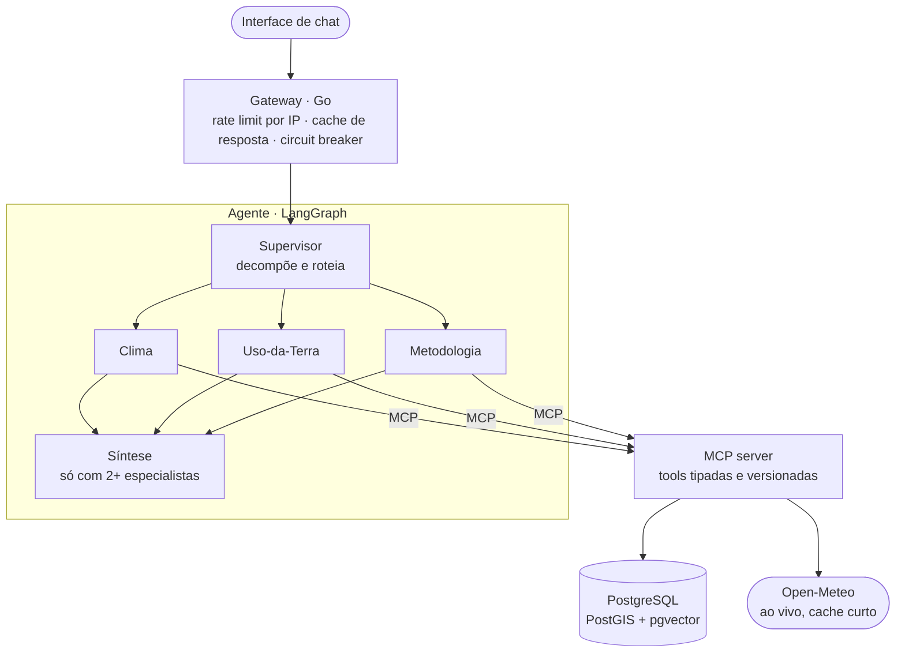
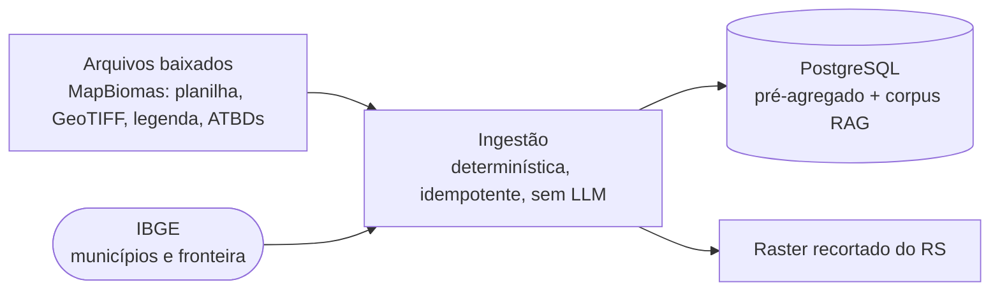

# data-fusion-platform-core


Sistema multiagente que funde **dados públicos institucionais brasileiros** (sensoriamento remoto do MapBiomas, clima e solo do Open-Meteo, malhas do IBGE) para monitoramento agro/GIS no Rio Grande do Sul. Um Supervisor roteia cada pergunta para especialistas que consultam dados pré-agregados em PostGIS, clima ao vivo e a metodologia oficial via RAG, sempre por tools MCP de contrato fixo. Caráter **informativo, nunca prescritivo**: nenhuma saída constitui recomendação de ação.

Este repositório é só o núcleo: agentes, tools MCP, gateway, ingestão e schema.

## O que ele faz

| Especialista | Pergunta de exemplo | Como responde |
|---|---|---|
| Clima | "Quanto choveu no Rio Grande do Sul nos últimos 7 dias?" | Open-Meteo ao vivo, com cache curto: temperatura, chuva, ET₀, umidade e temperatura do solo |
| Uso-da-Terra | "Como mudou o uso da terra em Santa Maria entre 1990 e 2020?" | séries MapBiomas pré-agregadas por município, classe e ano (1985–2025) |
| Uso-da-Terra | "Que classe de cobertura há no ponto -29.68, -53.81?" | leitura de um pixel do raster do RS já recortado |
| Metodologia | "Como a MapBiomas define e classifica a classe pastagem?" | RAG sobre os documentos de metodologia (ATBDs) da MapBiomas |
| Supervisor + síntese | "Quanto choveu no RS e que parcela do estado é agricultura?" | especialistas em paralelo e dados apresentados lado a lado, nunca como relação causal |

## Arquitetura





## Destaques de engenharia

**Agentes**
- **Orchestrator-workers:** o Supervisor faz uma chamada com saída estruturada para escolher especialistas e reescrever a sub-pergunta de cada um. Se o parse falhar, cai num padrão seguro.
- **Fan-out em paralelo:** especialistas independentes rodam como branches paralelas do grafo; a síntese só chama o LLM quando mais de um respondeu.
- **Tool-use (ReAct) via MCP:** cada especialista enxerga só o subconjunto de tools do seu domínio. O MCP separa o raciocínio do acesso a dado.
- **Pool de modelos por papel:** Supervisor, especialistas e síntese alternam entre modelos equivalentes, cada um com o seu rate limiter, para distribuir as chamadas.

**Dados e geoprocessamento**
- Ingestão em lote e **sem LLM**: agregação espacial pesada acontece uma vez, nunca numa consulta ao vivo.
- Planilha de estatísticas do MapBiomas somada entre biomas por município, com geocodes conferidos contra a lista canônica do IBGE (divergência é reportada, não ingerida em silêncio).
- GeoTIFF nacional recortado para o RS com a fronteira da API de Malhas do IBGE (mesmo CRS, sem reprojeção). Só o recorte fica.
- Legenda hierárquica do MapBiomas (níveis 1–4) versionada em SQL e conferida contra o CSV oficial. Toda tool de uso da terra exige `level` explícito, sem agregar em silêncio.

**Guardrails**
- **Todo número vem da tool:** os payloads crus das tools são a fonte de verdade, e o LLM só correlaciona e explica.
- **Recusa de recomendação em código:** pedidos como "devo irrigar?" ou "vale a pena comprar terra?" são detectados na pergunta, e um aviso fixo entra na resposta mesmo que o modelo não recuse sozinho.
- **Honestidade sobre cobertura:** fora do RS, ou num ano sem dado, a tool responde `available=false` com a explicação em vez de um número plausível.

**Confiabilidade**
- Gateway em Go com rate limit por IP, cache de resposta (a mesma pergunta não gasta cota de LLM de novo) e circuit breaker para o agente.
- Cache curto nas chamadas ao vivo (Open-Meteo e embedding da pergunta). Se o cache estiver fora, a tool continua respondendo.
- MCP server sem estado: um reinício dele não derruba o agente.

**Observabilidade e qualidade**
- Trace de roteamento no MLflow só com metadado estrutural (especialistas, tools, modelo por papel, latência), **sem o texto** da pergunta nem da resposta.
- **Avaliação determinística** em [`tests/eval/`](tests/eval/): perguntas reais ao agente checadas por regras puras, sem um LLM julgando outro.
- Dependências travadas com `uv.lock` por serviço, lint e format com `ruff`, e testes rodando dentro da imagem.

## Tools MCP

Contrato fixo e versionado: mudanças entram como nova versão, não como quebra de assinatura.

| Tool | Fonte |
|---|---|
| `get_weather_trend(region, period, granularity, variables)` | Open-Meteo (ao vivo, cache curto) |
| `get_land_use_summary(region, year, level=2)` | MapBiomas (anual, pré-agregado) |
| `get_land_use_change(region, year_from, year_to, level=2)` | MapBiomas (anual, pré-agregado) |
| `get_land_use_timeseries(region, level=2)` | MapBiomas (série 1985–2025 por classe) |
| `get_land_use_at_point(lat, lon, year, level=2)` | MapBiomas (raster do RS) |
| `search_mapbiomas_methodology(query, top_k=5)` | ATBDs MapBiomas (RAG, pgvector) |
| `resolve_region_point(region)` | geocoding, apoio à visualização |
| `get_land_use_raster_overlay(year, max_dim)` | raster do RS com a paleta oficial, apoio à visualização |

## Stack

| Camada | Tecnologia |
|---|---|
| Agentes | Python 3.11, LangChain, LangGraph, langchain-mcp-adapters, FastAPI |
| Tools | MCP (Python SDK), httpx, Pydantic |
| Gateway | Go 1.23, imagem distroless sem root |
| Dados | PostgreSQL + PostGIS + pgvector, migrações SQL com golang-migrate |
| Geoprocessamento | rasterio, NumPy |
| RAG | pypdf para extrair os ATBDs, embeddings de 3072 dimensões |
| Cache | Valkey (compatível com Redis) |
| Observabilidade | MLflow |
| Qualidade | uv, ruff, pytest, `go test` |

## Testes

Tudo roda em container, sem instalar nada na máquina. Cada serviço Python tem um alvo `test` no seu `Dockerfile`:

```sh
cd projects/satelite_agro/mcp_server
docker build --target test -t sa-mcp-test .
docker run --rm sa-mcp-test
```

O Gateway (Go):

```sh
cd shared/gateway
go test ./...
```

- **Unidade:** clientes HTTP com respostas simuladas, parsing da planilha e da legenda, recorte do raster, corpus RAG, grafo, Supervisor, especialistas, guardrails, rate limiter, cache e circuit breaker do gateway.
- **Avaliação:** o dataset [`cases/satelite_agro.json`](tests/eval/cases/satelite_agro.json) cobre roteamento entre especialistas (inclusive perguntas que pedem dois), honestidade sem dado (fora do RS, ano sem cobertura) e recusa de recomendação. As checagens estão em [`checks.py`](tests/eval/checks.py).

## Estrutura

```
shared/gateway/                    gateway em Go: rate limit, cache e circuit breaker
shared/db/migrations/              schema em migrações SQL versionadas (PostGIS, legenda, uso da terra, RAG)
projects/satelite_agro/agents/     Supervisor, especialistas, síntese e guardrails (LangGraph)
projects/satelite_agro/mcp_server/ tools MCP: clima, uso da terra, metodologia
projects/satelite_agro/ingestion/  pipeline de lote: legenda, municípios, uso da terra, raster, corpus RAG
tests/eval/                        avaliação determinística do agente
```

## Limitações

- Cobertura piloto: Rio Grande do Sul. Fora dele o agente recusa e explica em vez de estimar.
- Uso e cobertura da terra é um produto **anual** (MapBiomas) e é tratado como tendência histórica, não como leitura do dia.

## Licença e créditos

- **Código:** licença MIT (ver [`LICENSE`](LICENSE)). Cobre só o código deste repositório.
- **Dados:** [MapBiomas](https://brasil.mapbiomas.org/) e [Open-Meteo](https://open-meteo.com/), licenciados sob [CC BY 4.0](https://creativecommons.org/licenses/by/4.0/deed.pt_BR). [IBGE — Malhas Territoriais e Localidades](https://servicodados.ibge.gov.br/api/docs/malhas), sob a Política de Dados Abertos do Poder Executivo Federal (Decreto 8.777/2016): reuso livre com crédito à fonte (a política não define uma licença Creative Commons específica). Os dados não fazem parte do repositório.

## Aviso legal

Este é um **projeto de portfólio**, desenvolvido para estudo e demonstração técnica. Não tem vínculo, patrocínio ou endosso da MapBiomas, da Open-Meteo, do IBGE ou de qualquer outra instituição, e não é um serviço oficial dessas fontes.

- **Natureza informativa.** Todo o conteúdo produzido pelo sistema (respostas dos agentes, dados agregados, textos) tem caráter **estritamente informativo e de monitoramento**. Nenhuma saída constitui recomendação, aconselhamento ou parecer técnico, agronômico, ambiental, econômico, jurídico ou de qualquer outra natureza, nem deve ser usada como base única para decisão operacional. O sistema não substitui a avaliação de um profissional habilitado.
- **Dados de terceiros.** As informações vêm de fontes públicas externas e são reproduzidas "no estado em que se encontram", sem garantia de exatidão, completude ou atualidade. O recorte, a fusão e a agregação podem introduzir imprecisões adicionais.
- **Respostas geradas por modelo de linguagem.** Parte das respostas é redigida por um LLM e pode conter erros, omissões ou interpretações equivocadas, ainda que os números venham diretamente das fontes de dados.
- **Sem garantias.** O software é fornecido sem garantia, expressa ou implícita (ver [LICENSE](LICENSE)). Não há compromisso de disponibilidade, continuidade ou suporte. O uso é por conta e risco de quem o realiza, e os autores não se responsabilizam por perdas ou danos decorrentes dele.
